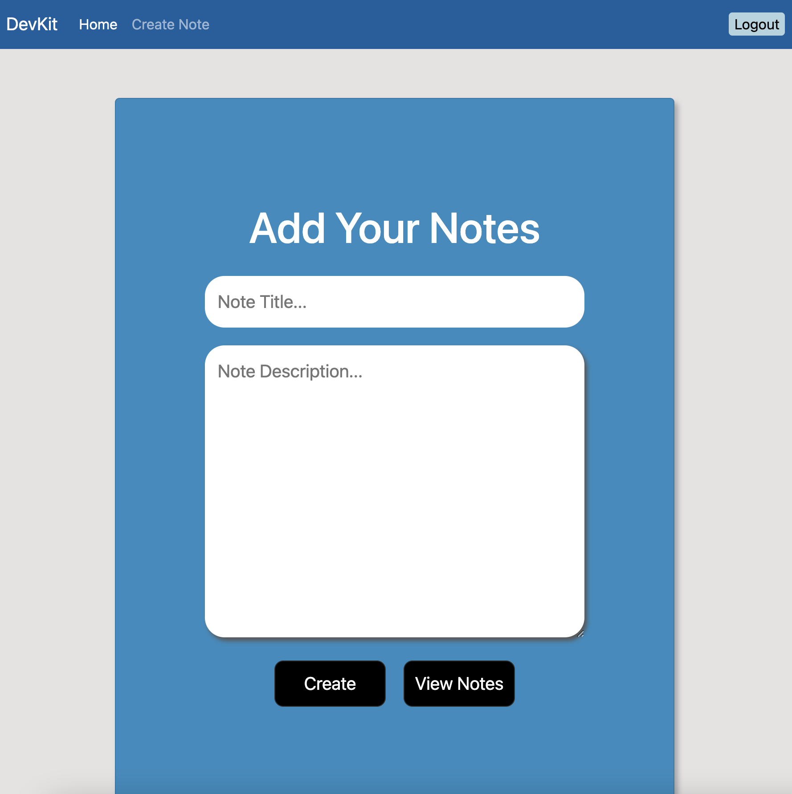

# DevKit

## Description

The idea behind Devkit was to create a "Quizlet" like Web page target towards developers. This is an environment to help aspiring developers study key concepts and create notes that also include flashcard sets. Some of the features include the ability to create an account, register and login, and create notes (and a flashcard set, corresponding to each note). We tried to make the studying process as simple as possible with all the tools we incorporated into DevKit.

## Screenshots

  

  

  

  

  

  

